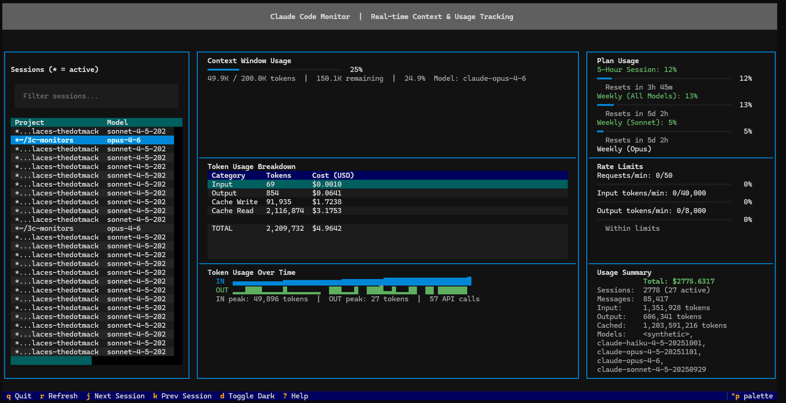

# ccmonitor

A terminal UI (TUI) for real-time monitoring of [Claude Code](https://docs.anthropic.com/en/docs/claude-code) context window usage, token consumption, costs, and subscription plan limits.



## Features

- **Context Window Gauge** — see how full your context window is per session
- **Token Usage Breakdown** — input, output, cache write, and cache read tokens with cost estimates
- **Sparkline Charts** — visual token usage trends over time
- **Session Browser** — navigate all active and recent Claude Code sessions
- **Plan Usage Monitoring** — track your Claude Max subscription limits (5-hour, weekly)
- **Rate Limit Tracking** — monitor requests/min and tokens/min against API limits
- **Cost Estimates** — per-session and aggregate cost based on published Anthropic pricing
- **Auto-Refresh** — configurable polling interval (default: 2s)
- **Dark/Light Themes** — toggle with `d`
- **Snapshot Mode** — one-shot terminal output without the TUI

## Requirements

- Python 3.10+
- An existing [Claude Code](https://docs.anthropic.com/en/docs/claude-code) installation (this tool reads its session data)

## Quick Start

```bash
git clone https://github.com/0toshigami/3c-monitors.git
cd 3c-monitors
uv run ccmonitor
```

No installation needed — `uv run` handles dependencies automatically.

## Installation

If you prefer a persistent install:

### Using uv (recommended)

```bash
uv venv
uv pip install -e .
ccmonitor
```

### Using pip

```bash
pip install -e .
ccmonitor
```

## Usage

### Interactive TUI

```bash
ccmonitor
```

### CLI Options

```
ccmonitor [OPTIONS]

Options:
  --claude-dir PATH    Path to Claude Code data directory (default: ~/.claude)
  --refresh SECONDS    Auto-refresh interval in seconds (default: 2.0)
  --snapshot           Print a one-time usage snapshot to stdout
  --check-token        Debug OAuth token discovery and exit
  -h, --help           Show help message
```

### Keyboard Shortcuts

| Key | Action |
|-----|--------|
| `q` | Quit |
| `r` | Refresh data now |
| `j` / `k` | Navigate sessions |
| `d` | Toggle dark/light theme |
| `?` | Show help overlay |

### Snapshot Mode

For scripts or quick checks, use snapshot mode to print a summary and exit:

```bash
ccmonitor --snapshot
```

## Authentication (Plan Usage)

To display subscription plan usage, ccmonitor needs an OAuth token. It automatically discovers tokens in this order:

1. `CCMONITOR_OAUTH_TOKEN` environment variable
2. `CLAUDE_SESSION_INGRESS_TOKEN_FILE` environment variable
3. `CLAUDE_CODE_OAUTH_TOKEN_FILE_DESCRIPTOR` file descriptor
4. `~/.claude/.credentials.json` (local Claude Code install)
5. Remote/container session ingress token files

If you're running Claude Code locally, it should work automatically. Use `--check-token` to debug token discovery.

## Architecture

```
src/ccmonitor/
├── __init__.py          # Package metadata
├── __main__.py          # CLI entry point and argument parsing
├── app.py               # Main Textual TUI application
├── collector.py         # Data collection, session parsing, API calls
└── widgets/
    ├── context_gauge.py # Context window fill gauge
    ├── cost_panel.py    # Cost and summary panel
    ├── plan_usage.py    # Subscription plan usage bars
    ├── rate_monitor.py  # Rate limit monitoring
    ├── session_list.py  # Session browser sidebar
    ├── sparkline.py     # Token usage sparkline charts
    └── usage_table.py   # Token usage breakdown table
```

## Development

```bash
# Clone and install with dev dependencies
git clone https://github.com/0toshigami/3c-monitors.git
cd 3c-monitors
uv venv
uv pip install -e .

# Lint
uvx ruff check src/
uvx ruff format --check src/

# Type check
uvx mypy src/

# Run tests
pytest
```

## License

[MIT](LICENSE)
